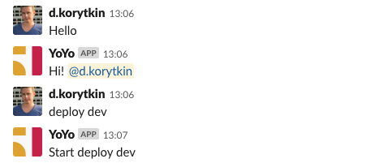

# slack-bot
Application for easy make slack bot

## Content:
  - [Getting started](#getting-started)
    - [How to use](#usage)
    - [Install](#installing)
    - [Dockerfile example](#dockerfile-example)
    - [Examples](#examples)
  - [Authors](#authors)
  - [License](#license)
  - [Dependencies](#dependencies)


## Getting Started:

### Installing:

```bash
pip install slack-bot
```

### Usage:

Code for base slack bot:

```python
# run.py

import os

from slack_bot import Application, Response


app = Application(token=os.getenv('SLACK_TOKEN'))


@app.route('hello')
def main(request):
    return Response(request=request, text=f'Hi! {request.user}')


@app.route('deploy {app:w}')
def deploy_staging(request):
    current_app = request.match_info["app"]
    # body for deploy staging ...
    return Response(request=request, text=f'Start deploy {current_app}')


if __name__ == '__main__':
    app.run()
```
Result:



### Dockerfile example:

```dockerfile
FROM python:3.7-alpine

WORKDIR app/

# This env variable by defauult equal 1
ENV RTM_READ_DELAY=1

# Run install your requirements
RUN pip install slack-bot

# Copy application modules to docker container
COPY . /app/

# Run module with intit application
CMD ['python', '/app/run.py']
```

### Examples:
Many examples, how to use `slack-bot` 


- Adding handlers to app with `@app.route` decorator

```python
import os

from slack_bot import Application, Response


TOKEN = os.getenv('SLACK_TOKEN')


app = Application(token=TOKEN)


@app.route('hello', channels=[], users=[])
def main(request):
    return Response(request=request, text=f'Hi! {request.user}')


if __name__ == '__main__':
    app.run()
``` 

- Use routes table, for adding handlers to app

```python
import os

from slack_bot import Application, Response, RoutersTable


table = RoutersTable()


@table.route('hello')
def say_hello(request):
    return Response(request=request, text=f'Hi! {request.user}')


if __name__ == '__main__':
    app = Application(token=os.getenv('SLACK_TOKEN'))
    app.run()

``` 

- Adding all handlers to app

```python
import os

from slack_bot import Application, Response, Route


def say_hello(request):
    return Response(request=request, text=f'Hi! {request.user}')


if __name__ == '__main__':
    app = Application(token=os.getenv('SLACK_TOKEN'))
    app.add_routes([
        Route(route='Hello', handler=say_hello),
    ])
    app.run()
``` 

## Authors:

 - Denis Korytkin

## License:

This project is licensed under the MIT License - see the [LICENSE.md](LICENSE.md) file for details


## Dependencies:

*base*

```bash
pip==19.0.3
setuptools==41.0.0
```

*application dependencies*

```bash
slackclient==1.3.1
parse==1.12.0
```

*slackclient dependencies*

```bash
certifi==2019.3.9
chardet==3.0.4
idna==2.8
requests==2.21.0
six==1.12.0
urllib3==1.24.2
websocket-client==0.47.0
```
